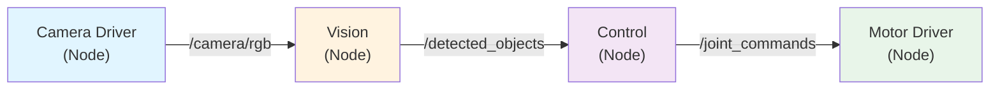
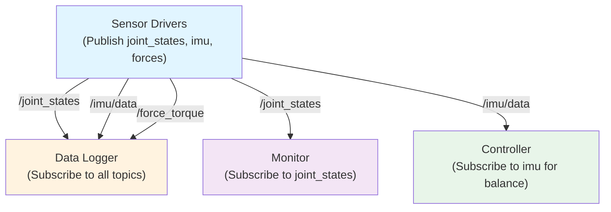

import Tabs from '@theme/Tabs';
import TabItem from '@theme/TabItem';

# Chapter 3: ROS 2 Fundamentals

## Learning Objectives

:::info
After this chapter, you will:

- **Understand** the ROS 2 graph architecture: decentralized, middleware-agnostic design
- **Build** your own ROS 2 nodes using rclpy (Python client library)
- **Implement** pub/sub patterns for sensor data streaming (topics)
- **Implement** RPC patterns for one-time requests (services)
- **Use** ROS 2 CLI tools for system introspection (`ros2 topic`, `ros2 service`, `rqt_graph`)
- **Create** ROS 2 packages and launch files for multi-node orchestration
- **Deploy** on Ubuntu 22.04 and Jetson Orin using colcon build system
:::

---

## 3.1: What is ROS 2?

### The Problem ROS 2 Solves

Imagine building a humanoid robot with 100+ sensors and actuators:
- **50 sensors** (cameras, IMU, force sensors, joint encoders)
- **30 actuators** (motors for joints)
- **10 planning/reasoning modules** (inverse kinematics, collision detection, vision processing)

Without standardization, this becomes a wiring nightmare:
- Each module needs custom code to talk to each other
- Sensor data must be serialized/deserialized
- Network communication is ad-hoc (UDP, TCP, custom protocols)
- Testing is impossible without the full robot

**ROS 2 (Robot Operating System 2)** solves this by providing:

1. **Middleware abstraction**: Swap communication backends (DDS, custom protocols) without changing user code
2. **Standard message types**: `std_msgs`, `sensor_msgs`, `geometry_msgs` for common data
3. **Pub/sub architecture**: Loose coupling between nodes
4. **Service RPC**: Synchronous request-response for critical commands
5. **CLI tooling**: Inspect running system without writing code

### ROS 2 vs. ROS 1

| Feature | ROS 1 | ROS 2 |
|---------|-------|-------|
| **Architecture** | Central master node | Fully decentralized |
| **Middleware** | Custom (roscomm) | DDS (industry standard) |
| **Real-time** | No | Yes (real-time DDS profiles) |
| **Security** | Minimal | Full (encryption, authentication) |
| **Python 3** | Limited | Native |
| **Windows/Mac** | Limited | Full support |
| **Status** | EOL (end of life) | Active (Humble LTS until 2027) |

**Recommendation**: Start with ROS 2 Humble (long-term support, production-ready).

### DDS: The Middleware

ROS 2 uses **DDS (Data Distribution Service)** as its underlying middleware. DDS is:
- **Open standard** (OMG - Object Management Group)
- **Used in defense, maritime, finance** (battle-tested)
- **Quality of Service (QoS)**: Tunable reliability, latency, bandwidth
- **Multiple implementations**: Fast-DDS (default), CycloneDDS, RTI Connext

Key concept: **Domain ID** isolates ROS 2 networks:
DDS Domain ID ∈ [0, 232]

Two robots on the same network with different Domain IDs won't interfere with each other.

---

## 3.2: Nodes & the Computation Graph

### What is a Node?

A **node** is a process that performs one logical function:



Each node:
- Runs in its own process (crash doesn't kill others)
- Communicates via topics (pub/sub) and services (RPC)
- Has its own lifecycle

### Example: Create Your First Node

<Tabs>
<TabItem value="talker" label="Publisher Node (talker.py)">

```python
#!/usr/bin/env python3
import rclpy
from rclpy.node import Node
from std_msgs.msg import String

class TalkerNode(Node):
    """Publisher node: sends messages to /chatter topic."""

    def __init__(self):
        super().__init__('talker')

        # Create publisher: topic name, message type, queue size
        self.publisher_ = self.create_publisher(String, '/chatter', 10)

        # Create timer: callback every 0.1 seconds (10 Hz)
        timer_period = 0.1
        self.timer = self.create_timer(timer_period, self.timer_callback)

        self.counter = 0

    def timer_callback(self):
        """Called every 0.1 seconds."""
        msg = String()
        msg.data = f'Hello World: {self.counter}'
        self.publisher_.publish(msg)
        self.get_logger().info(f'Publishing: "{msg.data}"')
        self.counter += 1

def main(args=None):
    rclpy.init(args=args)
    node = TalkerNode()

    # Spin: process callbacks indefinitely
    rclpy.spin(node)

    # Cleanup (reached if interrupted, e.g., Ctrl+C)
    node.destroy_node()
    rclpy.shutdown()

if __name__ == '__main__':
    main()
```

**Run it**:
```bash
# Terminal 1
source /opt/ros/humble/setup.bash
python3 talker.py
# Output:
# [INFO] Publishing: "Hello World: 0"
# [INFO] Publishing: "Hello World: 1"
# ...
```

</TabItem>
<TabItem value="listener" label="Subscriber Node (listener.py)">

```python
#!/usr/bin/env python3
import rclpy
from rclpy.node import Node
from std_msgs.msg import String

class ListenerNode(Node):
    """Subscriber node: listens to /chatter topic."""

    def __init__(self):
        super().__init__('listener')

        # Create subscriber: topic name, message type, callback, queue size
        self.subscription = self.create_subscription(
            String,
            '/chatter',
            self.listener_callback,
            10
        )

    def listener_callback(self, msg):
        """Called whenever a message arrives on /chatter."""
        self.get_logger().info(f'I heard: "{msg.data}"')

def main(args=None):
    rclpy.init(args=args)
    node = ListenerNode()
    rclpy.spin(node)
    node.destroy_node()
    rclpy.shutdown()

if __name__ == '__main__':
    main()
```

**Run it** (in a separate terminal):
```bash
# Terminal 2
source /opt/ros/humble/setup.bash
python3 listener.py
# Output:
# [INFO] I heard: "Hello World: 0"
# [INFO] I heard: "Hello World: 1"
# ...
```

</TabItem>
</Tabs>

---

## 3.3: Topics & Pub/Sub Pattern

### Why Pub/Sub?

Pub/Sub decouples producers from consumers:
- **Publisher** sends messages to a topic; doesn't know or care about subscribers
- **Subscriber** listens to a topic; doesn't care about publishers
- **Multiple pubs/subs** on same topic (many-to-many communication)

### Real-World Example: Robot Telemetry



Each subscriber receives the same data; sensor drivers don't need to know who's listening.

### Code: Publish Joint States (for simulation)

<Tabs>
<TabItem value="joint_pub" label="Joint State Publisher">

```python
#!/usr/bin/env python3
import rclpy
from rclpy.node import Node
from sensor_msgs.msg import JointState
import numpy as np

class JointStatePublisher(Node):
    """Publish joint states from simulated 2-DOF arm."""

    def __init__(self):
        super().__init__('joint_publisher')
        self.publisher_ = self.create_publisher(JointState, '/joint_states', 10)
        self.timer = self.create_timer(0.05, self.timer_callback)  # 20 Hz
        self.time = 0.0

    def timer_callback(self):
        msg = JointState()
        msg.header.stamp = self.get_clock().now().to_msg()
        msg.header.frame_id = 'base_link'
        msg.name = ['joint_1', 'joint_2']

        # Simulate sinusoidal motion
        msg.position = [
            np.sin(self.time),
            np.cos(2 * self.time)
        ]
        msg.velocity = [
            np.cos(self.time),
            -2 * np.sin(2 * self.time)
        ]
        msg.effort = [0.5, 0.3]  # Torques

        self.publisher_.publish(msg)
        self.time += 0.05

def main(args=None):
    rclpy.init(args=args)
    node = JointStatePublisher()
    rclpy.spin(node)
    node.destroy_node()
    rclpy.shutdown()

if __name__ == '__main__':
    main()
```

</TabItem>
</Tabs>

### QoS Profiles

ROS 2 QoS policies control reliability vs. latency trade-off:

```python
from rclpy.qos import QoSProfile, ReliabilityPolicy, HistoryPolicy

# High-bandwidth sensor data: best-effort, low latency
qos_sensor = QoSProfile(
    reliability=ReliabilityPolicy.BEST_EFFORT,
    history=HistoryPolicy.KEEP_LAST,
    depth=5
)

# Critical commands: reliable delivery
qos_critical = QoSProfile(
    reliability=ReliabilityPolicy.RELIABLE,
    history=HistoryPolicy.KEEP_ALL
)

subscriber = self.create_subscription(
    Imu, '/imu/data', self.imu_callback, qos_sensor
)
```

---

## 3.4: Services & RPC

### When to Use Services?

- **Topics**: Continuous streaming (sensor data, 100+ Hz)
- **Services**: One-time queries or critical commands (IK request, gripper activation)

### Code: Add Two Numbers Service

<Tabs>
<TabItem value="service_server" label="Service Server">

```python
#!/usr/bin/env python3
import rclpy
from rclpy.node import Node
from example_interfaces.srv import AddTwoInts

class AddTwoIntsServer(Node):
    """Service server: adds two integers on request."""

    def __init__(self):
        super().__init__('add_server')
        self.srv = self.create_service(
            AddTwoInts,
            '/add_two_ints',
            self.add_callback
        )
        self.get_logger().info('Service /add_two_ints is ready')

    def add_callback(self, request, response):
        """Handle incoming service request."""
        response.sum = request.a + request.b
        self.get_logger().info(f'Request: {request.a} + {request.b} = {response.sum}')
        return response

def main(args=None):
    rclpy.init(args=args)
    node = AddTwoIntsServer()
    rclpy.spin(node)
    node.destroy_node()
    rclpy.shutdown()

if __name__ == '__main__':
    main()
```

</TabItem>
<TabItem value="service_client" label="Service Client">

```python
#!/usr/bin/env python3
import rclpy
from rclpy.node import Node
from example_interfaces.srv import AddTwoInts
import sys

class AddTwoIntsClient(Node):
    """Service client: calls /add_two_ints service."""

    def __init__(self, a, b):
        super().__init__('add_client')
        self.cli = self.create_client(AddTwoInts, '/add_two_ints')

        # Wait for service to become available
        while not self.cli.wait_for_service(timeout_sec=1.0):
            self.get_logger().info('Waiting for service...')

        self.req = AddTwoInts.Request()
        self.req.a = a
        self.req.b = b

    def send_request(self):
        self.future = self.cli.call_async(self.req)

def main(args=None):
    rclpy.init(args=args)

    if len(sys.argv) != 3:
        print("Usage: python3 client.py <a> <b>")
        return

    a, b = int(sys.argv[1]), int(sys.argv[2])
    client = AddTwoIntsClient(a, b)
    client.send_request()

    # Wait for response (blocking)
    rclpy.spin_until_future_complete(client, client.future)
    result = client.future.result()

    client.get_logger().info(f'{a} + {b} = {result.sum}')
    client.destroy_node()
    rclpy.shutdown()

if __name__ == '__main__':
    main()
```

**Run it**:
```bash
# Terminal 1: Start server
python3 server.py

# Terminal 2: Call service
python3 client.py 3 5
# Output: 3 + 5 = 8
```

</TabItem>
</Tabs>

---

## 3.5: Packages & Build System

### ROS 2 Package Structure

```
my_robot_pkg/
 package.xml          # Metadata
 setup.py             # Python setup
 my_robot_pkg/        # Source code
    __init__.py
    talker.py
    listener.py
 test/                # Unit tests
```

### Build with colcon

```bash
# Build all packages in workspace
colcon build

# Build specific package
colcon build --packages-select my_robot_pkg

# Build and test
colcon build --cmake-args -DCMAKE_BUILD_TYPE=Release

# After building, source install
source install/setup.bash

# Now you can run nodes
ros2 run my_robot_pkg talker
```

---

## 3.6: CLI Tools & Introspection

### Discover Running System

```bash
# List all nodes
ros2 node list

# List all topics
ros2 topic list

# List all services
ros2 service list

# Echo topic data (real-time)
ros2 topic echo /joint_states

# Measure topic frequency
ros2 topic hz /joint_states

# Visualize computation graph
rqt_graph
```

---

## 3.7: Embodiment Challenge

:::danger

### **Build a Real-Time Robot Telemetry System**

**Problem**:

Design a ROS 2 system that streams real-time sensor data from a simulated humanoid robot to a monitoring dashboard.

**Requirements**:
- **Sensor node**: Publishes joint positions (50 Hz), IMU data (100 Hz), forces (30 Hz)
- **Logger node**: Subscribes to all topics; records to CSV file
- **Monitor node**: Visualizes live joint positions (real-time plot)
- **No packet loss**: All data must arrive in order

**Current Benchmarks**:
- Tesla Optimus: Streams 200+ sensors in real-time
- Boston Dynamics Atlas: 100+ Hz control loop
- Figure AI: Real-time telemetry at 50-100 Hz for arm tasks

**Your Deliverable**:
1. **Sensor node** (simulates joint states, IMU, forces)
2. **Logger node** (writes to CSV with timestamps)
3. **Monitor node** (displays statistics: mean position, frequency, packet loss)
4. **Measurement**: Latency from sensor publish to logger write (goal: under 50 ms)

**Success Metrics**:
-  All three nodes run without errors
-  Topics publish at correct frequencies
-  Logger records 100% of messages
-  Monitor shows live statistics
-  Latency under 50 ms p95

:::

---

## References

[1] **ROS 2 Official Documentation**. (2024). *ROS 2 Humble Hawksbill*. [https://docs.ros.org/en/humble/](https://docs.ros.org/en/humble/)

[2] **Object Management Group (OMG)**. (2015). *Data Distribution Service (DDS) Standard*. [https://www.omg.org/spec/DDS/](https://www.omg.org/spec/DDS/)

[3] **Brown, C., et al.** (2022). "ROS 2: The Robotics Operating System for the Next Decade." *IEEE Robotics & Automation Magazine*, 29(4), 102–112.

[4] **Macenski, S., et al.** (2022). "Robot Operating System 2: Design, Architecture, and Uses in the Wild." *Science Robotics*, 7(66), eabm6293.

---

## Next Steps

:::info

 **You now know how to code robot software** using ROS 2: nodes, topics, services, packages.

→ **Chapter 4: Digital Twin Simulation** teaches you to **simulate** all these concepts in Gazebo before running on real hardware.

Ready? → [**Chapter 4: Digital Twin Simulation**](./ch4-sim.mdx)

:::

---

## RAG Integration Hooks

:::rag-query
**"What's the difference between ROS 1 and ROS 2? Should I learn ROS 1 first?"**

No—start with ROS 2. ROS 1 is end-of-life; ROS 2 is production-ready and will dominate for the next decade.
:::

:::rag-query
**"How do I debug ROS 2 latency issues in my robot system?"**

Use `ros2 topic hz` to measure frequencies, `rqt_graph` to visualize connections, and `rclpy` logging to trace message timestamps.
:::

:::rag-query
**"Should I use topics or services for my robot's sensor data?"**

Topics for continuous streams (cameras, IMU, joint encoders). Services for one-time requests (inverse kinematics, gripper activation).
:::
