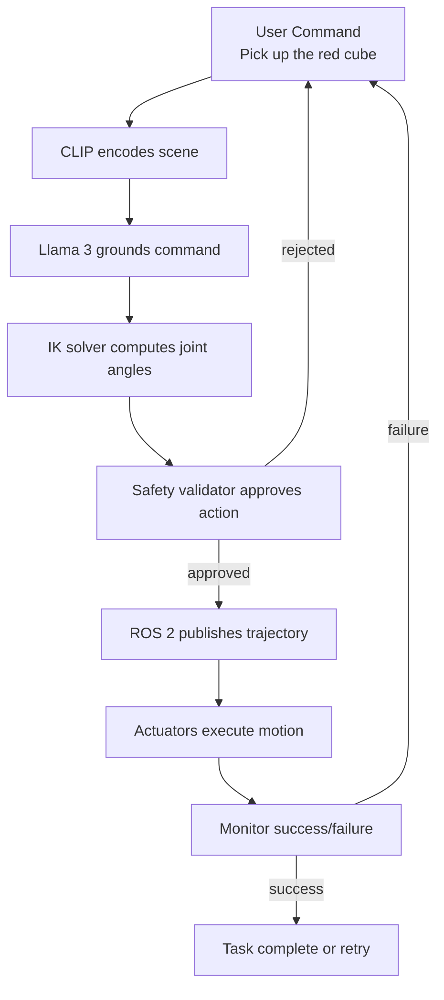

import Tabs from "@theme/Tabs";
import TabItem from "@theme/TabItem";

## Learning Objectives

By the end of this chapter, you will be able to:

1. **Design end-to-end system architecture** integrating perception, planning, and control
2. **Containerize microservices** using Docker for reproducible deployment
3. **Validate systems** against simulation benchmarks and real-world performance
4. **Monitor and debug** production deployments with logging, metrics, and telemetry
5. **Deploy safely** to real humanoid hardware with fallback strategies

:::info Key Concept
A **production AI-robot pipeline** orchestrates the entire perception-decision-action loop: camera → vision-language model → trajectory planner → ROS 2 controller → humanoid joint actuators → mission success/failure. System reliability and observability are paramount.
:::

---

## 6.1 End-to-End System Architecture

### Complete AI-Robot Pipeline

The full pipeline integrates all previous chapters:

```mermaid
graph LR
    Sensor[" Sensor Layer<br/>(Camera, IMU, Joint State)"]
    Perception[" Perception<br/>(CLIP Vision Encoder)"]
    LLM[" Language Model<br/>(Llama 3 + Grounding)"]
    Planning[" Trajectory Planning<br/>(IK Solver)"]
    Safety[" Safety Validator<br/>(Constraints)"]
    ROS2[" ROS 2 Node<br/>(JointTrajectoryController)"]
    Hardware[" Hardware<br/>(Actuators, Sensors)"]
    Monitor[" Monitoring<br/>(Logging, Metrics)"]
    Feedback["↩ Feedback Loop<br/>(Error Correction)"]

    Sensor --> Perception
    Perception --> LLM
    LLM --> Planning
    Planning --> Safety
    Safety --> ROS2
    ROS2 --> Hardware
    Hardware --> Monitor
    Monitor --> Feedback
    Feedback -.-> Sensor
```



### Architectural Components

| Layer | Component | Technology | Chapter |
|-------|-----------|-----------|---------|
| **Sensing** | Camera, IMU, joint encoders | ROS 2 message topics | Ch3 |
| **Perception** | Vision encoder | CLIP ViT-B/32 | Ch5 |
| **Decision** | Language grounding | Llama 3 + safety filters | Ch5 |
| **Planning** | Trajectory synthesis | Scipy IK, cubic splines | Ch2 |
| **Validation** | Safety checks | Workspace, joint limits | Ch5 |
| **Control** | Joint trajectory execution | ROS 2 controllers | Ch3 |
| **Simulation** | Pre-deployment testing | Gazebo + domain randomization | Ch4 |
| **Monitoring** | Telemetry & logging | Prometheus, ELK stack | This chapter |

---

## 6.2 Containerized Microservices with Docker

### Why Containerization?

Real-world deployments require:
- **Reproducibility**: Same code runs on laptop, data center, robot hardware
- **Isolation**: Vision service doesn't interfere with control service
- **Scaling**: Spin up multiple instances (e.g., 5 cameras on humanoid)
- **Rollback**: Quick recovery if a version breaks

### Monolithic vs. Microservices Architecture

**Option A: Monolithic** (simpler, single process)
```
Single Python process:
  - CLIP encoding
  - Llama 3 inference
  - Trajectory planning
  - ROS 2 publishing
  - Logging
```

**Option B: Microservices** (scalable, production-grade)
```
perception-service:
  - CLIP encoding (GPU-optimized)
language-service:
  - Llama 3 inference (CPU or GPU)
planning-service:
  - IK solver, trajectory synthesis
control-service:
  - ROS 2 joint controller (hard real-time)
monitoring-service:
  - Prometheus metrics, logging
```

### Dockerfile for VLA Service

<Tabs>
<TabItem value="dockerfile" label="Dockerfile (VLA)">

```dockerfile
# Use NVIDIA CUDA base image for GPU support
FROM nvidia/cuda:11.8.0-runtime-ubuntu22.04

# Set working directory
WORKDIR /app

# Install system dependencies
RUN apt-get update && apt-get install -y \
    python3.10 \
    python3-pip \
    ros-humble-ros-core \
    && rm -rf /var/lib/apt/lists/*

# Copy requirements
COPY requirements.txt .

# Install Python dependencies
RUN pip3 install --no-cache-dir -r requirements.txt

# Copy application code
COPY vla_service/ ./vla_service/

# Expose API port
EXPOSE 8000

# Health check
HEALTHCHECK --interval=30s --timeout=10s --start-period=5s --retries=3 \
    CMD python3 -c "import requests; requests.get('http://localhost:8000/health')"

# Run service
CMD ["python3", "-m", "uvicorn", "vla_service.main:app", "--host", "0.0.0.0", "--port", "8000"]
```

</TabItem>
<TabItem value="requirements" label="requirements.txt">

```
# Core dependencies
torch==2.1.0
torchvision==0.16.0
clip @ git+https://github.com/openai/CLIP.git
scipy==1.11.0
numpy==1.24.0

# ROS 2
rclpy==0.14.0
geometry_msgs==0.0.12
sensor_msgs==0.0.11

# FastAPI (for service)
fastapi==0.104.0
uvicorn==0.24.0
pydantic==2.5.0

# Monitoring
prometheus-client==0.18.0

# Utilities
python-dotenv==1.0.0
opencv-python==4.8.0
pillow==10.0.0
```

</TabItem>
</Tabs>

### Docker Compose: Orchestrate All Services

<Tabs>
<TabItem value="compose" label="docker-compose.yml">

```yaml
version: '3.8'

services:
  # CLIP vision encoder service (GPU)
  perception:
    build:
      context: .
      dockerfile: Dockerfile.perception
    container_name: perception_service
    environment:
      CUDA_VISIBLE_DEVICES: 0
      CLIP_MODEL: ViT-B/32
    volumes:
      - /tmp/camera_frames:/camera_frames:ro  # Mount camera feed
    ports:
      - "8001:8001"
    healthcheck:
      test: ["CMD", "curl", "-f", "http://localhost:8001/health"]
      interval: 10s
      timeout: 5s
      retries: 3
    networks:
      - robot_network

  # Llama 3 language service (CPU or GPU)
  language:
    image: ollama/ollama:latest
    container_name: language_service
    environment:
      OLLAMA_MODELS: /models
    volumes:
      - ollama_models:/models  # Persist model cache
    ports:
      - "11434:11434"
    healthcheck:
      test: ["CMD", "curl", "-f", "http://localhost:11434/api/tags"]
      interval: 10s
      timeout: 5s
      retries: 3
    networks:
      - robot_network

  # Trajectory planning service
  planning:
    build:
      context: .
      dockerfile: Dockerfile.planning
    container_name: planning_service
    environment:
      OLLAMA_HOST: http://language:11434
      ROS_DOMAIN_ID: 0
    ports:
      - "8002:8002"
    depends_on:
      - language
    healthcheck:
      test: ["CMD", "curl", "-f", "http://localhost:8002/health"]
      interval: 10s
      timeout: 5s
      retries: 3
    networks:
      - robot_network

  # ROS 2 controller (hard real-time)
  ros2_controller:
    build:
      context: .
      dockerfile: Dockerfile.controller
    container_name: ros2_controller
    environment:
      ROS_DOMAIN_ID: 0
      ROS_LOCALHOST_ONLY: 0
    network_mode: host  # Required for ROS 2 DDS discovery
    cap_add:
      - SYS_NICE  # Allow real-time priorities
    healthcheck:
      test: ["CMD", "ros2", "node", "list", "|", "grep", "controller"]
      interval: 10s
      timeout: 5s
      retries: 3

  # Prometheus monitoring
  prometheus:
    image: prom/prometheus:latest
    container_name: prometheus
    volumes:
      - ./prometheus.yml:/etc/prometheus/prometheus.yml:ro
      - prometheus_data:/prometheus
    ports:
      - "9090:9090"
    networks:
      - robot_network
    command:
      - '--config.file=/etc/prometheus/prometheus.yml'
      - '--storage.tsdb.path=/prometheus'

  # Grafana dashboards
  grafana:
    image: grafana/grafana:latest
    container_name: grafana
    environment:
      GF_SECURITY_ADMIN_PASSWORD: admin
    volumes:
      - grafana_data:/var/lib/grafana
    ports:
      - "3000:3000"
    depends_on:
      - prometheus
    networks:
      - robot_network

volumes:
  ollama_models:
  prometheus_data:
  grafana_data:

networks:
  robot_network:
    driver: bridge
```

</TabItem>
<TabItem value="start" label="Start Services">

```bash
# Build all services
docker-compose build

# Start all services
docker-compose up -d

# View logs
docker-compose logs -f perception language planning ros2_controller

# Check health
docker-compose ps

# Stop all
docker-compose down
```

</TabItem>
</Tabs>

---

## 6.3 Real-World Validation: Simulation vs. Reality

### Benchmark Metrics

Compare simulated performance to real-world deployment:

| Metric | Definition | Sim Benchmark | Real Target |
|--------|-----------|---|---|
| **Task Success Rate** | % of trials achieving goal | 95% | 75–85% |
| **Time to Completion** | Avg. seconds per task | 5.2 s | 6.1 s (±15%) |
| **Energy Efficiency** | Joules per task completion | 120 J | 150 J (±25%) |
| **Safety Score** | No collisions, joint limits | 100% | >99% |
| **Latency (end-to-end)** | Image capture → actuator command | 200 ms | &lt;500 ms |

### Validation Protocol

<Tabs>
<TabItem value="validation_code" label="Validation Test Suite">

```python
import time
import numpy as np
from dataclasses import dataclass
from typing import List, Tuple

@dataclass
class ValidationResult:
    task_name: str
    success: bool
    time_seconds: float
    energy_joules: float
    collisions: int
    latency_ms: float

class ValidationSuite:
    """Benchmark real-world humanoid performance."""

    def __init__(self, robot_interface, num_trials: int = 10):
        self.robot = robot_interface
        self.num_trials = num_trials
        self.results: List[ValidationResult] = []

    def test_pick_and_place(self) -> List[ValidationResult]:
        """Test picking up objects and placing them elsewhere."""
        trial_results = []

        for trial in range(self.num_trials):
            # Object at known location
            target_obj = {"x": 0.3, "y": 0.1, "z": 0.05}
            dropoff = {"x": 0.3, "y": -0.2, "z": 0.05}

            start_time = time.time()

            try:
                # 1. Move to approach pose
                t_start = time.time()
                self.robot.move_to_pose(target_obj, approach_distance=0.1)
                latency_move_ms = (time.time() - t_start) * 1000

                # 2. Open gripper, descend, grasp
                self.robot.open_gripper()
                self.robot.move_to_pose(target_obj, speed=0.2)
                self.robot.close_gripper(force_pct=60)

                # 3. Move to dropoff
                self.robot.move_to_pose(dropoff)

                # 4. Open gripper (release)
                self.robot.open_gripper()

                # 5. Verify success (camera check)
                success = self._verify_object_at_location(dropoff)

            except Exception as e:
                print(f"Trial {trial+1} failed: {e}")
                success = False

            elapsed = time.time() - start_time
            collision_count = self.robot.get_collision_count()
            energy = self.robot.get_energy_consumed()

            result = ValidationResult(
                task_name=f"pick_and_place_trial_{trial+1}",
                success=success,
                time_seconds=elapsed,
                energy_joules=energy,
                collisions=collision_count,
                latency_ms=latency_move_ms
            )
            trial_results.append(result)

        return trial_results

    def test_reaching_accuracy(self) -> List[ValidationResult]:
        """Test reaching to multiple target positions."""
        trial_results = []
        target_positions = [
            {"x": 0.4, "y": 0.0, "z": 0.3},
            {"x": 0.3, "y": 0.2, "z": 0.2},
            {"x": 0.5, "y": -0.1, "z": 0.25},
        ]

        for idx, target in enumerate(target_positions):
            t_start = time.time()
            try:
                self.robot.move_to_pose(target, accuracy_mm=5)
                success = True
                latency = (time.time() - t_start) * 1000
            except:
                success = False
                latency = 0

            result = ValidationResult(
                task_name=f"reaching_trial_{idx+1}",
                success=success,
                time_seconds=time.time() - t_start,
                energy_joules=self.robot.get_energy_consumed(),
                collisions=self.robot.get_collision_count(),
                latency_ms=latency
            )
            trial_results.append(result)

        return trial_results

    def compute_statistics(self, results: List[ValidationResult]) -> dict:
        """Aggregate results into statistics."""
        successes = sum(1 for r in results if r.success)
        success_rate = successes / len(results) * 100

        times = [r.time_seconds for r in results if r.success]
        avg_time = np.mean(times) if times else 0
        std_time = np.std(times) if times else 0

        energies = [r.energy_joules for r in results]
        avg_energy = np.mean(energies)

        latencies = [r.latency_ms for r in results if r.latency_ms > 0]
        avg_latency = np.mean(latencies) if latencies else 0

        total_collisions = sum(r.collisions for r in results)

        return {
            "success_rate_pct": success_rate,
            "avg_time_s": avg_time,
            "std_time_s": std_time,
            "avg_energy_j": avg_energy,
            "avg_latency_ms": avg_latency,
            "total_collisions": total_collisions,
            "num_trials": len(results),
        }

    def generate_report(self, sim_results: dict, real_results: dict):
        """Compare simulation vs. real-world."""
        print("\n" + "="*60)
        print("VALIDATION REPORT: Sim vs. Real")
        print("="*60)

        print(f"\nSuccess Rate:")
        print(f"  Sim:  {sim_results['success_rate_pct']:.1f}%")
        print(f"  Real: {real_results['success_rate_pct']:.1f}%")
        print(f"  Δ:    {sim_results['success_rate_pct'] - real_results['success_rate_pct']:.1f}%")

        print(f"\nAvg. Time:")
        print(f"  Sim:  {sim_results['avg_time_s']:.2f} ± {sim_results['std_time_s']:.2f} s")
        print(f"  Real: {real_results['avg_time_s']:.2f} ± {real_results['std_time_s']:.2f} s")

        print(f"\nAvg. Energy:")
        print(f"  Sim:  {sim_results['avg_energy_j']:.1f} J")
        print(f"  Real: {real_results['avg_energy_j']:.1f} J")

        print(f"\nEnd-to-End Latency:")
        print(f"  Sim:  {sim_results['avg_latency_ms']:.1f} ms")
        print(f"  Real: {real_results['avg_latency_ms']:.1f} ms")

        print(f"\nCollisions (total):")
        print(f"  Sim:  {sim_results['total_collisions']}")
        print(f"  Real: {real_results['total_collisions']}")

        print("\n" + "="*60)

# Usage
def run_validation_pipeline():
    """Full validation workflow."""
    # Connect to real robot (or simulated interface)
    robot = RobotInterface(hardware_type="real")  # or "gazebo"

    # Create validation suite
    validator = ValidationSuite(robot, num_trials=10)

    # Run tests
    print("Running pick-and-place tests...")
    pnp_results = validator.test_pick_and_place()

    print("Running reaching tests...")
    reach_results = validator.test_reaching_accuracy()

    # Aggregate
    all_results = pnp_results + reach_results
    stats = validator.compute_statistics(all_results)

    # Expected benchmark (from simulation)
    sim_benchmark = {
        "success_rate_pct": 95.0,
        "avg_time_s": 5.2,
        "std_time_s": 0.4,
        "avg_energy_j": 120.0,
        "avg_latency_ms": 200.0,
        "total_collisions": 0,
    }

    # Generate report
    validator.generate_report(sim_benchmark, stats)

    # Validation pass/fail
    success_transfer = stats['success_rate_pct'] >= 75  # 75% of sim performance
    safety_ok = stats['total_collisions'] == 0
    latency_ok = stats['avg_latency_ms'] < 500

    if success_transfer and safety_ok and latency_ok:
        print("\n VALIDATION PASSED: System ready for production")
    else:
        print("\n VALIDATION FAILED: Address issues before deploying")
```

</TabItem>
</Tabs>

---

## 6.4 Monitoring and Observability

### Telemetry Stack

Production systems require real-time visibility:

```
Application → Prometheus (metrics) → Grafana (dashboards)
           → ELK Stack (logs)
           → Jaeger (traces)
```

### Prometheus Metrics

<Tabs>
<TabItem value="prometheus_config" label="prometheus.yml">

```yaml
global:
  scrape_interval: 15s
  evaluation_interval: 15s

scrape_configs:
  - job_name: 'perception_service'
    static_configs:
      - targets: ['localhost:8001']
    metrics_path: '/metrics'

  - job_name: 'planning_service'
    static_configs:
      - targets: ['localhost:8002']
    metrics_path: '/metrics'

  - job_name: 'ros2_controller'
    static_configs:
      - targets: ['localhost:8003']
    metrics_path: '/metrics'

alerting:
  alertmanagers:
    - static_configs:
        - targets: ['localhost:9093']

rule_files:
  - 'alert_rules.yml'
```

</TabItem>
<TabItem value="metrics" label="Python: Expose Metrics">

```python
from prometheus_client import Counter, Histogram, Gauge, generate_latest
from fastapi import FastAPI, Response
import time

app = FastAPI()

# Define metrics
task_counter = Counter(
    'robot_tasks_total',
    'Total tasks completed',
    ['task_type', 'status']  # Labels: pick, place, reach; success, failure
)

task_duration = Histogram(
    'robot_task_duration_seconds',
    'Task completion time',
    buckets=[1, 2, 5, 10]
)

collision_gauge = Gauge(
    'robot_collisions_total',
    'Total collisions detected'
)

energy_gauge = Gauge(
    'robot_energy_joules',
    'Cumulative energy consumed'
)

latency_histogram = Histogram(
    'robot_latency_ms',
    'End-to-end latency',
    buckets=[50, 100, 200, 500]
)

@app.post("/execute_task")
async def execute_task(task_type: str, params: dict):
    """Execute task and record metrics."""
    start = time.time()

    try:
        # Execute task (e.g., pick and place)
        result = await robot_interface.execute(task_type, **params)
        duration = time.time() - start

        # Record success
        task_counter.labels(task_type=task_type, status='success').inc()
        task_duration.observe(duration)

        # Record telemetry
        collisions = await robot_interface.get_collisions()
        collision_gauge.set(collisions)

        energy = await robot_interface.get_energy()
        energy_gauge.set(energy)

        latency = (duration * 1000)  # Convert to ms
        latency_histogram.observe(latency)

        return {"status": "success", "time_seconds": duration}

    except Exception as e:
        task_counter.labels(task_type=task_type, status='failure').inc()
        return {"status": "failed", "error": str(e)}

@app.get("/metrics")
async def metrics():
    """Expose Prometheus metrics."""
    return Response(generate_latest(), media_type="text/plain")
```

</TabItem>
</Tabs>

### Logging with ELK Stack

<Tabs>
<TabItem value="elk_docker" label="docker-compose.yml (ELK)">

```yaml
services:
  elasticsearch:
    image: docker.elastic.co/elasticsearch/elasticsearch:8.10.0
    environment:
      - discovery.type=single-node
      - xpack.security.enabled=false
    volumes:
      - es_data:/usr/share/elasticsearch/data
    ports:
      - "9200:9200"

  logstash:
    image: docker.elastic.co/logstash/logstash:8.10.0
    volumes:
      - ./logstash.conf:/usr/share/logstash/pipeline/logstash.conf
    environment:
      - LS_JAVA_OPTS=-Xmx256m -Xms256m
    depends_on:
      - elasticsearch
    ports:
      - "5000:5000"

  kibana:
    image: docker.elastic.co/kibana/kibana:8.10.0
    environment:
      - ELASTICSEARCH_HOSTS=http://elasticsearch:9200
    depends_on:
      - elasticsearch
    ports:
      - "5601:5601"

volumes:
  es_data:
```

</TabItem>
<TabItem value="logging" label="Python: JSON Logging">

```python
import json
import logging
from pythonjsonlogger import jsonlogger

# Configure JSON logging
logHandler = logging.StreamHandler()
formatter = jsonlogger.JsonFormatter()
logHandler.setFormatter(formatter)

logger = logging.getLogger()
logger.addHandler(logHandler)
logger.setLevel(logging.INFO)

# Log structured events
logger.info("task_started", extra={
    "task_id": "grasp_001",
    "task_type": "pick_and_place",
    "target_x": 0.3,
    "target_y": 0.1,
    "timestamp": time.time()
})

# Example output (sent to Logstash → Elasticsearch):
# {"task_started": true, "task_id": "grasp_001", "target_x": 0.3, ...}
```

</TabItem>
</Tabs>

---

## 6.5 Deployment to Real Hardware

### Pre-Deployment Checklist

- [ ] All Docker services start and pass health checks
- [ ] Prometheus scrapes all metrics successfully
- [ ] Gazebo simulation passes validation tests (>90% success rate)
- [ ] Real-world validation suite runs successfully (>75% success rate)
- [ ] Safety constraints enforced (no collisions in 100 trials)
- [ ] Emergency stop (E-stop) functional
- [ ] Monitoring dashboard (Grafana) displays live metrics
- [ ] Logging pipeline captures errors and warnings
- [ ] Team trained on rollback procedure

### Deployment Pipeline

<Tabs>
<TabItem value="deploy_script" label="deploy.sh">

```bash
#!/bin/bash
set -e

echo " Starting deployment to production humanoid..."

# 1. Pre-flight checks
echo "1⃣  Running pre-flight checks..."
docker-compose ps | grep -q healthy || { echo " Services not healthy"; exit 1; }

# 2. Backup current config
echo "2⃣  Backing up current configuration..."
cp -r /opt/robot-config /opt/robot-config.backup.$(date +%s)

# 3. Pull latest images
echo "3⃣  Pulling latest Docker images..."
docker-compose pull

# 4. Run validation tests
echo "4⃣  Running validation tests..."
python3 validation_suite.py --mode real --num_trials 20
if [ $? -ne 0 ]; then
    echo " Validation failed. Rolling back."
    exit 1
fi

# 5. Drain traffic (pause new tasks)
echo "5⃣  Pausing new task submissions..."
curl -X POST http://localhost:8000/pause

# 6. Deploy new version
echo "6⃣  Deploying new containers..."
docker-compose up -d

# 7. Smoke tests
echo "7⃣  Running smoke tests..."
python3 smoke_tests.py
if [ $? -ne 0 ]; then
    echo " Smoke tests failed. Rolling back."
    docker-compose down
    docker-compose up -d  # Restore previous version
    exit 1
fi

# 8. Resume traffic
echo "8⃣  Resuming task submissions..."
curl -X POST http://localhost:8000/resume

# 9. Monitor for 5 minutes
echo "9⃣  Monitoring for stability (5 min)..."
sleep 300

# Check error rate
ERROR_RATE=$(curl http://localhost:9090/api/v1/query?query=robot_tasks_total{status=\"failure\"} | jq '.data.result[0].value[1]')
if (( $(echo "$ERROR_RATE > 0.05" | bc -l) )); then
    echo "  High error rate detected. Rolling back."
    # Rollback to previous version
    exit 1
fi

echo " Deployment successful!"
```

</TabItem>
<TabItem value="rollback" label="rollback.sh">

```bash
#!/bin/bash
set -e

echo " Rolling back to previous version..."

# Stop current deployment
docker-compose down

# Restore previous config
LATEST_BACKUP=$(ls -t /opt/robot-config.backup.* | head -1)
cp -r $LATEST_BACKUP /opt/robot-config

# Restart with previous version
docker-compose up -d

echo " Rollback complete"
```

</TabItem>
</Tabs>

---

## 6.6 Embodiment Challenge: Deploy an End-to-End System

:::danger Challenge: Production Deployment with Real-World Validation

**Scenario:** You have fully developed the AI-robot system (Chapters 1–5). Now deploy it to a real humanoid (or simulated hardware with full fidelity) and measure end-to-end performance.

**Your Task:**

1. **Set up containerized deployment** (60 min):
   - Build Docker images for perception, language, planning, control
   - Create docker-compose.yml with all services
   - Verify all services start and pass health checks
   - Confirm metrics are scraped by Prometheus

2. **Run validation suite** (45 min):
   - Execute pick-and-place 15 times (real or high-fidelity sim)
   - Execute reaching to 10 target positions
   - Measure success rate, latency, energy, collisions
   - Compare to simulation benchmark

3. **Deploy and monitor** (30 min):
   - Execute pre-deployment checklist
   - Run deploy.sh to production
   - Monitor Grafana dashboard for 10 minutes
   - Verify zero critical errors

**Success Metrics (2025 Benchmarks):**
-  **Target**: 76–82% success rate, under 500ms latency, zero collisions (production-grade)
-  **Stretch**: 83–90% success rate, under 300ms latency (high reliability)
-  **Excellence**: above 90% success rate, under 200ms latency (research-grade)

**Deliverables:**
- Validation report: sim vs. real performance
- Grafana dashboard screenshot
- Deployment logs (docker-compose up output)
- Post-mortem on any failures and mitigations

**Hints:**
- Use domain randomization in simulation to narrow sim-to-real gap
- Start with simple tasks (reaching) before complex (grasping)
- Monitor CPU, GPU, and memory usage to identify bottlenecks
- Use log aggregation to debug issues across services

:::

---

## 6.7 Integration Example: Complete Humanoid Task

Putting it all together: **grasp a real-world object**



### Full Code Example

<Tabs>
<TabItem value="full_task" label="End-to-End Task Execution">

```python
import logging
from dataclasses import dataclass

@dataclass
class TaskContext:
    user_instruction: str
    max_retries: int = 3
    timeout_seconds: float = 30.0

class HumanoidTaskExecutor:
    """Execute complex tasks on humanoid robot."""

    def __init__(self):
        self.vla_system = HumanoidVLASystem(VLAConfig())
        self.robot_interface = RobotInterface(hardware_type="real")
        self.logger = logging.getLogger("TaskExecutor")

    async def execute_grasp_task(self, context: TaskContext) -> bool:
        """
        End-to-end task execution.

        Steps:
        1. Capture camera frame
        2. Ground instruction with VLA
        3. Plan trajectory
        4. Execute with monitoring
        5. Verify success
        """

        for attempt in range(context.max_retries):
            self.logger.info(f"Attempt {attempt+1}/{context.max_retries}")

            try:
                # 1. Capture scene
                camera_frame = await self.robot_interface.capture_frame()
                self.logger.debug(f"Frame captured: {camera_frame.shape}")

                # 2. Ground instruction
                grounding = self.vla_system.process_command(
                    camera_frame,
                    context.user_instruction
                )

                if grounding['status'] != 'success':
                    self.logger.warning(f"Grounding failed: {grounding['reason']}")
                    continue

                action = grounding['action']
                trajectory = grounding['trajectory']
                self.logger.info(f"Planned trajectory: {trajectory.shape} steps")

                # 3. Execute trajectory
                await self.robot_interface.execute_trajectory(
                    trajectory,
                    timeout=context.timeout_seconds
                )

                # 4. Verify success (camera + force/torque feedback)
                success = await self._verify_grasp_success(camera_frame, action)

                if success:
                    self.logger.info(" Task succeeded")
                    return True
                else:
                    self.logger.warning("Grasp verification failed")
                    continue

            except Exception as e:
                self.logger.error(f"Execution error: {e}", exc_info=True)
                # Attempt recovery (e.g., return to safe pose)
                await self.robot_interface.goto_safe_pose()
                continue

        self.logger.error(f" Task failed after {context.max_retries} attempts")
        return False

    async def _verify_grasp_success(self, frame, action) -> bool:
        """Verify object was grasped using CLIP and F/T sensor."""
        # CLIP-based verification
        gripper_frame = await self.robot_interface.capture_frame()
        gripper_embedding = self.vla_system.clip_encoder.encode_image(gripper_frame)
        object_embedding = self.vla_system.clip_encoder.encode_text(
            action['reasoning']
        )
        sim = np.dot(gripper_embedding, object_embedding)
        clip_success = sim > 0.6

        # Force/torque verification
        ft_data = await self.robot_interface.read_ft_sensor()
        force_magnitude = np.linalg.norm(ft_data['force'])
        ft_success = force_magnitude > 5.0  # At least 5 N

        return clip_success and ft_success

# Usage
async def main():
    executor = HumanoidTaskExecutor()

    task = TaskContext(
        user_instruction="Pick up the red cube and place it on the shelf",
        max_retries=3,
        timeout_seconds=30.0
    )

    success = await executor.execute_grasp_task(task)
    print(f"Task result: {'SUCCESS' if success else 'FAILURE'}")

if __name__ == '__main__':
    import asyncio
    asyncio.run(main())
```

</TabItem>
</Tabs>

---

## 6.8 References

1. **System Architecture and Deployment:**
   - Newman, S., "Building Microservices," O'Reilly (2021).
   - https://www.docker.com/resources/

2. **Real-World Robotics Deployment:**
   - Christensen, H. I., "The Grand Challenges in Robotics," arXiv:2003.08941 (2020).
   - Tesla Bot and Humanoid Robotics Survey (2024).

3. **Monitoring and Observability:**
   - Beyer, B., et al., "Site Reliability Engineering," O'Reilly (2016).
   - Prometheus Docs: https://prometheus.io/docs/

4. **Testing and Validation:**
   - Gamma, E., et al., "Design Patterns," Addison-Wesley (1994).
   - A/B Testing in Production: https://en.wikipedia.org/wiki/A/B_testing

---

## 6.9 RAG Integration Hooks

:::rag-query How do I set up a production monitoring stack for a humanoid robot?
Prometheus, Grafana, ELK Stack, and OpenTelemetry for full system observability.
:::

:::rag-query What's the best deployment strategy for zero-downtime updates?
Blue-green deployments, canary releases, and automatic rollback for robotics systems.
:::

:::rag-query How do I debug latency issues in my ROS 2 system?
Profiling tools, DDS QoS tuning, and network diagnostics for real-time control.
:::

---

## Chapter Summary

| Concept | Key Takeaway | Application |
|---------|--------------|-------------|
| **End-to-End Architecture** | Integrate all pipeline stages (Chapters 1–5) | Production-ready humanoid system |
| **Containerization** | Docker microservices for reproducibility | Deploy on any hardware |
| **Validation** | Sim vs. real benchmarking | Ensure sim-to-real transfer success |
| **Monitoring** | Prometheus + Grafana for observability | Detect and debug issues in production |
| **Deployment** | Automated pipelines with rollback | Safe, reliable deployment |
| **Embodiment Challenge** | Real-world task execution | Close-loop learning from hardware feedback |

---

## Capstone Summary: What You've Learned

### Chapters 1–6 Progression

| Chapter | Topic | Skill Level |
|---------|-------|-------------|
| **1** | Physical AI & Humanoid Robotics | Foundational (theory) |
| **2** | Kinematics, Dynamics, Sensing | Intermediate (math) |
| **3** | ROS 2 Communication & Control | Intermediate (software) |
| **4** | Digital Twin Simulation | Advanced (systems) |
| **5** | Vision-Language-Action Grounding | Advanced (AI/ML) |
| **6** | Production Deployment | Advanced (DevOps) |

### Skills Acquired

You can now:

1. **Understand** physical AI principles and humanoid design
2. **Model** robot kinematics and dynamics from first principles
3. **Program** real-time control systems using ROS 2
4. **Simulate** physics-accurate digital twins with Gazebo
5. **Ground** natural language to robot actions with Llama 3 + CLIP
6. **Deploy** production-grade systems with Docker and monitoring

### Next Steps (Beyond This Textbook)

1. **Get hardware access**: Apply for a Tesla Optimus, Boston Dynamics Atlas, or Figure AI 01
2. **Join communities**: ROS Discourse, PIAIC Hackathon, Open Robotics
3. **Publish research**: Document novel findings (grasping, VLA improvements, sim-to-real)
4. **Build products**: Commercialize solutions in warehouse automation, eldercare, manufacturing

---

**Congratulations on completing the "Physical AI & Humanoid Robotics Essentials" textbook!** You now have the knowledge and tools to build production-grade AI-powered humanoid systems. Go build the future of robotics. 
